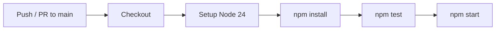

# DevOps Pipelines

A sample Node.js application demonstrating CI/CD pipelines with GitHub Actions.

## Quick Start

```bash
npm install
npm start
npm test
```

## Pipeline

```yaml
name: CI Pipeline
on:
  push:
    branches: [main]
  pull_request:
    branches: [main]
jobs:
  build:
    runs-on: ubuntu-latest
    steps:
      - uses: actions/checkout@v5
      - uses: actions/setup-node@v6
        with:
          node-version: 24
      - run: npm install
      - run: npm test
      - run: npm start
```



## Stages

| Stage | What It Does |
|-------|-------------|
| Checkout | Pulls the code |
| Setup Node | Installs Node.js v24 |
| Install | Runs `npm install` |
| Test | Runs `npm test` |
| Start | Runs `npm start` |

## Project Files

| File | Purpose |
|------|---------|
| `index.js` | Main application entry point |
| `test.js` | Test suite |
| `.github/workflows/pipeline.yaml` | GitHub Actions CI pipeline |
