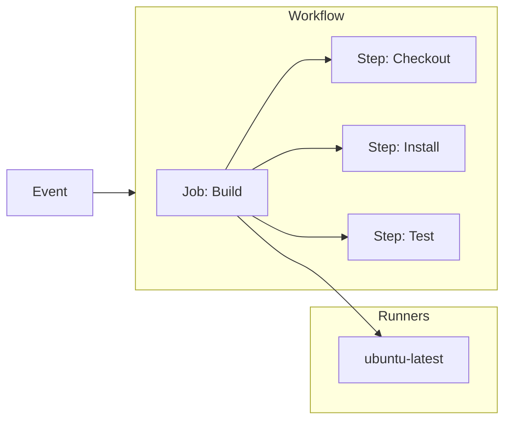
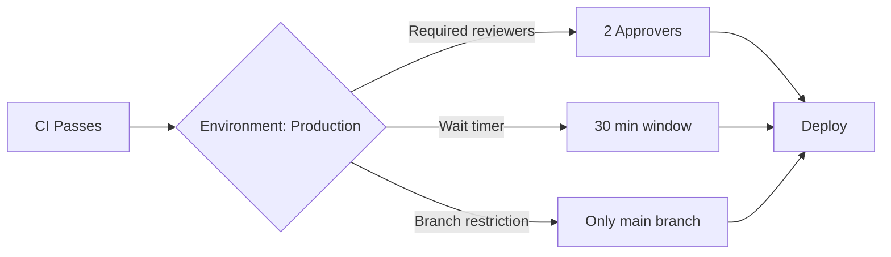

# 02 — GitHub Actions

> GitHub Actions is a CI/CD platform that automates builds, tests, and deployments directly from your GitHub repository.

---

## Core Concepts



| Concept | Description | Analogy |
|---------|-------------|---------|
| **Event** | What triggers the workflow (push, PR, schedule) | Doorbell |
| **Workflow** | The entire automation process (one `.yml` file) | Recipe book |
| **Job** | A logical unit of work (runs on one runner) | Cooking station |
| **Step** | Individual command or action within a job | Single instruction |
| **Runner** | VM that executes the job | Chef |
| **Action** | Reusable unit of automation (community or official) | Pre-made ingredient |

---

## Workflow Anatomy

```yaml
# .github/workflows/ci.yml
name: CI Pipeline

on:
  push:
    branches: [main]
  pull_request:
    branches: [main]
  schedule:
    - cron: '0 6 * * 1'  # Every Monday at 6 AM

env:
  NODE_VERSION: '20'

jobs:
  test:
    runs-on: ubuntu-latest
    timeout-minutes: 10

    services:
      postgres:
        image: postgres:16
        env:
          POSTGRES_PASSWORD: postgres
        options: >-
          --health-cmd pg_isready
          --health-interval 10s
          --health-timeout 5s
          --health-retries 5
        ports:
          - 5432:5432

    steps:
      - uses: actions/checkout@v4

      - uses: actions/setup-node@v4
        with:
          node-version: ${{ env.NODE_VERSION }}
          cache: 'npm'

      - run: npm ci
      - run: npm run lint
      - run: npm test

      - uses: actions/upload-artifact@v4
        if: always()
        with:
          name: test-results
          path: test-results/
```

---

## Events (Triggers)

```yaml
on:
  push                              # Any push to any branch
  push:
    branches: [main, 'release/*']   # Specific branches
    tags: ['v*']                     # Specific tags
    paths:
      - 'src/**'                     # Only if src/ changes
      - '!docs/**'                   # Exclude docs/

  pull_request:
    types: [opened, synchronize, reopened]  # Default
    branches: [main]

  schedule:
    - cron: '0 */4 * * *'           # Every 4 hours
    - cron: '0 0 * * 0'             # Weekly Sunday midnight

  workflow_dispatch:                 # Manual trigger
    inputs:
      environment:
        description: 'Target environment'
        required: true
        default: 'staging'
        type: choice
        options:
          - staging
          - production

  repository_dispatch:               # External API trigger
    types: [deploy-command]

  release:
    types: [published]
```

---

## Expressions & Contexts

```yaml
jobs:
  example:
    steps:
      - run: echo "Branch: ${{ github.ref_name }}"
      - run: echo "SHA: ${{ github.sha }}"
      - run: echo "Actor: ${{ github.actor }}"
      - run: echo "Event: ${{ github.event_name }}"
      
      - run: echo "Runner OS: ${{ runner.os }}"
      - run: echo "Runner Arch: ${{ runner.arch }}"
      
      - run: echo "Env: ${{ vars.DEPLOY_ENV }}"
      - run: echo "Secret set: ${{ secrets.API_KEY != '' }}"
      
      - run: echo "Previous step: ${{ steps.checkout.outcome }}"

      # Functions
      - run: echo "${{ contains(github.ref_name, 'release') }}"
      - run: echo "${{ startsWith(github.ref, 'refs/tags/') }}"
      - run: echo "${{ format('Hello {0}', 'World') }}"
      - run: echo "${{ join(github.event.commits.*.message, '\n') }}"
```

### Available Contexts

| Context | Description | Example |
|---------|-------------|---------|
| `github` | Event, repository, workflow info | `github.sha`, `github.ref` |
| `env` | Custom environment variables | `env.NODE_VERSION` |
| `vars` | Repository/org variables | `vars.DEPLOY_REGION` |
| `secrets` | Encrypted secrets | `secrets.AWS_ACCESS_KEY_ID` |
| `runner` | Runner OS, arch, name | `runner.os` |
| `steps` | Step outputs | `steps.build.output.status` |
| `job` | Job status | `job.status` |
| `matrix` | Matrix strategy values | `matrix.node-version` |
| `needs` | Dependent job contexts | `needs.build.result` |

---

## Conditional Execution

```yaml
jobs:
  deploy:
    if: github.ref == 'refs/heads/main' && github.event_name == 'push'
    runs-on: ubuntu-latest
    
    steps:
      - run: echo "Deploying to production"
      
      - name: Skip on forks
        if: github.event.pull_request.head.repo.fork == false
        run: echo "Not a fork — safe to deploy"
        
      - name: Always run (even if previous step fails)
        if: always()
        run: echo "Cleanup step"
        
      - name: Run only on failure
        if: failure()
        run: echo "Pipeline failed — notify on-call"
        
      - name: Run on success
        if: success()
        run: echo "Pipeline passed"
        
      - name: Run when cancelled
        if: cancelled()
        run: echo "Pipeline cancelled"
```

---

## Matrix Builds

```yaml
jobs:
  test:
    strategy:
      matrix:
        os: [ubuntu-latest, windows-latest, macos-latest]
        node: [18, 20, 22]
        include:
          - os: ubuntu-latest
            node: 20
            coverage: true        # Extra field for this combination
        exclude:
          - os: macos-latest
            node: 18              # Skip this combination
      fail-fast: false            # Don't cancel other matrix jobs on failure
      max-parallel: 3             # Max concurrent matrix jobs

    runs-on: ${{ matrix.os }}
    continue-on-error: ${{ matrix.experimental || false }}

    steps:
      - uses: actions/setup-node@v4
        with:
          node-version: ${{ matrix.node }}
      - run: npm test
      - if: matrix.coverage
        run: npm run coverage
```

---

## Caching

```yaml
- name: Cache dependencies
  uses: actions/cache@v4
  with:
    path: |
      ~/.npm
      node_modules
    key: ${{ runner.os }}-npm-${{ hashFiles('**/package-lock.json') }}
    restore-keys: |
      ${{ runner.os }}-npm-
      ${{ runner.os }}-

- name: Cache Docker layers
  uses: actions/cache@v4
  with:
    path: /tmp/.buildx-cache
    key: ${{ runner.os }}-docker-${{ github.sha }}
    restore-keys: |
      ${{ runner.os }}-docker-
```

### Dependency Caching Comparison

| Tool | Cache Location | Key Strategy |
|------|---------------|--------------|
| npm | `~/.npm` | `hashFiles('package-lock.json')` |
| pip | `~/.cache/pip` | `hashFiles('requirements.txt')` |
| Maven | `~/.m2` | `hashFiles('pom.xml')` |
| Gradle | `~/.gradle/caches` | `hashFiles('*.gradle*')` |
| Go | `~/go/pkg/mod` | `hashFiles('go.sum')` |

---

## Reusable Workflows

### Caller Workflow

```yaml
# .github/workflows/deploy.yml
name: Deploy

on:
  workflow_call:
    inputs:
      environment:
        required: true
        type: string
    secrets:
      cloud_token:
        required: true

jobs:
  call-test:
    uses: ./.github/workflows/test.yml
    with:
      node-version: '20'

  deploy:
    needs: call-test
    runs-on: ubuntu-latest
    steps:
      - run: echo "Deploying to ${{ inputs.environment }}"
```

### Called Workflow

```yaml
# .github/workflows/test.yml
name: Test Suite

on:
  workflow_call:
    inputs:
      node-version:
        required: true
        type: string

jobs:
  test:
    runs-on: ubuntu-latest
    steps:
      - uses: actions/checkout@v4
      - uses: actions/setup-node@v4
        with:
          node-version: ${{ inputs.node-version }}
      - run: npm ci && npm test
```

---

## Composite Actions

```yaml
# .github/actions/setup-env/action.yml
name: "Setup Environment"
description: "Installs dependencies and configures the environment"
inputs:
  node-version:
    description: "Node.js version"
    required: true
    default: "20"

runs:
  using: "composite"
  steps:
    - uses: actions/setup-node@v4
      with:
        node-version: ${{ inputs.node-version }}

    - name: Install dependencies
      shell: bash
      run: npm ci

    - name: Create config
      shell: bash
      run: cp .env.example .env
```

```yaml
# Using the composite action
steps:
  - uses: actions/checkout@v4
  - uses: ./.github/actions/setup-env
    with:
      node-version: '22'
```

---

## Self-Hosted Runners

```yaml
jobs:
  build:
    runs-on: [self-hosted, linux, x64, gpu]
    
    steps:
      - uses: actions/checkout@v4
      - run: nvidia-smi  # GPU check
```

### Runner Setup

```bash
# On your VM/machine:
mkdir actions-runner && cd actions-runner
curl -o actions-runner-linux-x64-2.317.0.tar.gz -L \
  https://github.com/actions/runner/releases/download/v2.317.0/actions-runner-linux-x64-2.317.0.tar.gz
tar xzf actions-runner-linux-x64-2.317.0.tar.gz

./config.sh --url https://github.com/org/repo --token YOUR_TOKEN
./run.sh

# Install as service:
sudo ./svc.sh install
sudo ./svc.sh start
```

---

## Secrets & Variables

```yaml
# Repository settings → Secrets and variables → Actions

jobs:
  deploy:
    steps:
      - name: Access variable
        run: echo "Region: ${{ vars.AWS_REGION }}"

      - name: Access secret
        run: echo "${{ secrets.AWS_ACCESS_KEY_ID }}" | docker login --username AWS --password-stdin

      - name: Use OIDC (no secrets needed)
        uses: aws-actions/configure-aws-credentials@v4
        with:
          role-to-assume: arn:aws:iam::123456789:role/GitHubActions
          aws-region: us-east-1
```

### OpenID Connect (OIDC) — No Static Secrets

```yaml
# Instead of storing AWS keys as secrets, use OIDC:
jobs:
  deploy:
    permissions:
      id-token: write
      contents: read

    steps:
      - uses: aws-actions/configure-aws-credentials@v4
        with:
          role-to-assume: ${{ vars.AWS_ROLE_ARN }}
          aws-region: us-east-1

      - run: aws s3 sync ./dist s3://my-bucket
```

---

## Environment Protection Rules

```yaml
jobs:
  deploy-prod:
    runs-on: ubuntu-latest
    environment:
      name: production
      url: https://app.example.com

    steps:
      - run: echo "Deploying to production"
```



---

## Performance Optimization

```yaml
# Parallel jobs
jobs:
  lint:
  test:
  build:
    needs: [lint, test]  # Build runs AFTER lint + test complete in parallel

# Dependency order
jobs:
  lint:
  test:
  build:
    needs: test
  deploy:
    needs: build
```

### Pipeline Timing Comparison

```
Sequential:  Lint(2m) -> Test(5m) -> Build(3m) -> Deploy(2m) = 12m
Parallel:    Lint(2m) + Test(5m) -> Build(3m) -> Deploy(2m) = 10m
Optimized:   Lint(2m) + Test(5m) -> Build(3m) -> Deploy(2m) = 10m
Cached:      Lint(1m) + Test(3m) -> Build(2m) -> Deploy(2m) = 8m
```

---

## Artifacts

```yaml
# Upload
- name: Upload build
  uses: actions/upload-artifact@v4
  with:
    name: build-${{ github.sha }}
    path: dist/
    retention-days: 7             # Auto-delete after 7 days
    compression-level: 6          # 0-9 (9 = smallest, slowest)

# Download in a later job
- name: Download build
  uses: actions/download-artifact@v4
  with:
    name: build-${{ github.sha }}
    path: dist/
```

---

## Workflow Commands

```yaml
steps:
  - run: |
      echo "::notice title=Build Status::Build completed successfully"
      echo "::warning title=Deprecation::Node 16 is deprecated"
      echo "::error title=Failure::Tests failed in module X"
      
      # Set output
      echo "status=passed" >> $GITHUB_OUTPUT
      
      # Set environment variable for subsequent steps
      echo "API_URL=https://api.example.com" >> $GITHUB_ENV
      
      # Mask a secret from logs
      echo "::add-mask::my-secret-token"
      
      # Group log lines
      echo "::group::Installing dependencies"
      npm install
      echo "::endgroup::"
```

---

## Bill of Materials

| Feature | GitHub Free | GitHub Team | GitHub Enterprise |
|---------|-------------|-------------|-------------------|
| Runner minutes/mo | 2,000 | 3,000 | 50,000 |
| Concurrent jobs | 20 | 60 | 180 |
| Artifact storage | 500 MB | 1 GB | 50 GB |
| Self-hosted runners | Unlimited | Unlimited | Unlimited |
| Required reviewers | — | ✓ | ✓ |
| Environment secrets | — | ✓ | ✓ |
| Deployment branches | — | ✓ | ✓ |
