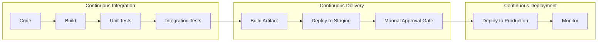
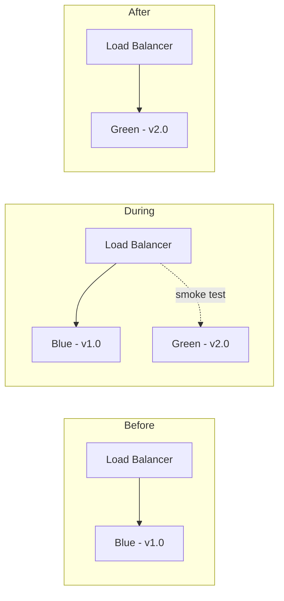
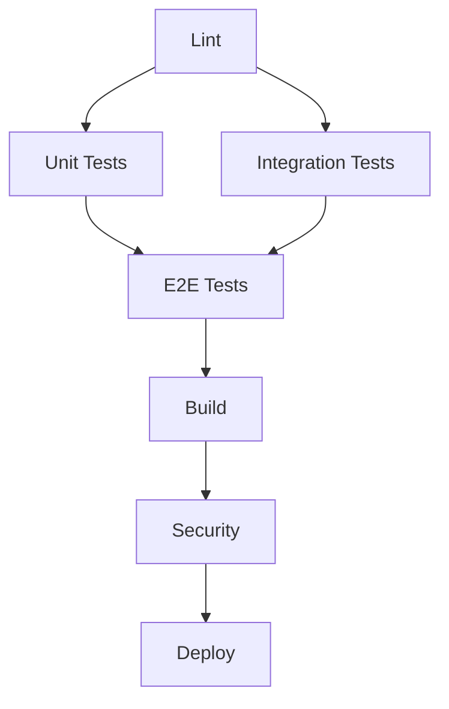
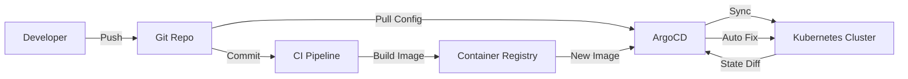

# 03 — CI/CD Deep Dive

> CI/CD is the backbone of DevOps automation. This module covers pipeline strategies, security, optimization, and deployment patterns used at top tech companies.

---

## CI vs CD vs CD — The Three Stages



| Stage | What | How Often | Who Approves |
|-------|------|-----------|-------------|
| **CI** | Build + test every commit | Every push | Automated |
| **Continuous Delivery** | Artifact ready, deploy needs manual click | Every commit to main | Human |
| **Continuous Deployment** | Every passing commit goes to production | Multiple times/day | Nobody |

---

## Deployment Strategies

### Blue/Green Deployment



```yaml
jobs:
  deploy:
    steps:
      - name: Deploy to green
        run: |
          kubectl apply -f k8s/green-deployment.yaml
          kubectl rollout status deployment/app-green -n production

      - name: Smoke test green
        run: |
          curl -f http://green.app.internal/health

      - name: Switch traffic to green
        run: |
          kubectl patch service app -n production \
            -p '{"spec":{"selector":{"version":"v2.0"}}}'

      - name: Drain blue
        run: |
          kubectl scale deployment/app-blue -n production --replicas=0
```

### Canary Deployment

```yaml
jobs:
  canary:
    steps:
      - name: Deploy 5% canary
        run: |
          kubectl scale deployment/app-canary --replicas=1
          kubectl scale deployment/app-stable --replicas=19

      - name: Monitor for 10 minutes
        run: |
          sleep 600
          # Check error rate < 0.1% and latency p99 < 500ms
          ./check-metrics.sh

      - name: Gradual rollout
        run: |
          # 25%
          kubectl scale deployment/app-canary --replicas=5
          kubectl scale deployment/app-stable --replicas=15
          sleep 300
          ./check-metrics.sh

          # 50%
          kubectl scale deployment/app-canary --replicas=10
          kubectl scale deployment/app-stable --replicas=10
          sleep 300
          ./check-metrics.sh

          # 100%
          kubectl scale deployment/app-canary --replicas=20
          kubectl scale deployment/app-stable --replicas=0
```

### Rolling Update

```yaml
# Kubernetes handles this natively:
strategy:
  type: RollingUpdate
  rollingUpdate:
    maxSurge: 25%        # Extra pods during update
    maxUnavailable: 25%  # Pods that can be down during update
```

---

## Pipeline Security

### Supply Chain Security

```yaml
jobs:
  security:
    steps:
      # 1. Verify commit signatures
      - run: |
          git verify-commit HEAD
          git verify-tag $(git describe --tags)

      # 2. Scan dependencies
      - uses: actions/dependency-review-action@v4
        with:
          fail-on-severity: high

      # 3. SAST (Static Analysis)
      - uses: github/codeql-action/analyze@v3
        with:
          category: "/language:javascript"

      # 4. Container scanning
      - uses: aquasecurity/trivy-action@master
        with:
          image-ref: "app:${{ github.sha }}"
          format: "sarif"
          output: "trivy-results.sarif"
          severity: "CRITICAL,HIGH"

      # 5. License compliance
      - uses: fossas/fossa-action@v1

      # 6. SBOM generation
      - uses: anchore/sbom-action@v0
        with:
          path: ./dist
          format: spdx-json
```

### Secrets in Pipelines

```yaml
# Bad
- run: docker login -u admin -p Password123

# Good — use secrets
- run: echo "${{ secrets.REGISTRY_PASSWORD }}" | docker login -u ${{ secrets.REGISTRY_USER }} --password-stdin

# Better — use OIDC (no secrets at all)
- uses: aws-actions/configure-aws-credentials@v4
  with:
    role-to-assume: arn:aws:iam::123456789:role/GitHubActions
    aws-region: us-east-1

# Best — short-lived tokens with auto-rotation
- name: Get short-lived token
  id: token
  run: |
    TOKEN=$(curl -H "Authorization: bearer ${{ secrets.APP_TOKEN }}" \
      https://vault.example.com/v1/token/create?ttl=5m)
    echo "token=$TOKEN" >> $GITHUB_OUTPUT
```

### Permission Minimalism

```yaml
jobs:
  deploy:
    permissions:
      contents: read           # Only need to read code
      id-token: write          # Needed for OIDC
      deployments: write       # For GitHub deployments
      pull-requests: read      # For commenting on PRs
      # NOT: contents: write (don't need to push)
      # NOT: issues: write
```

---

## Pipeline Optimization

### Parallel Execution

```yaml
jobs:
  lint:
  unit-test:
  integration-test:
    needs: [lint]
  e2e-test:
    needs: [unit-test, integration-test]
  build:
    needs: [e2e-test]
  security-scan:
    needs: [build]
  deploy:
    needs: [build, security-scan]
```



### Test Selection

```yaml
# Only run relevant tests based on what changed
steps:
  - name: Determine changed files
    id: changed
    uses: tj-actions/changed-files@v44
    with:
      files: |
        src/**
        tests/**

  - name: Run only affected tests
    if: steps.changed.outputs.any_changed == 'true'
    run: npx jest --onlyChanged --ci
```

### BuildKit Cache

```yaml
- name: Set up Docker Buildx
  uses: docker/setup-buildx-action@v3

- name: Build with cache
  uses: docker/build-push-action@v5
  with:
    cache-from: type=gha
    cache-to: type=gha,mode=max
```

---

## GitOps Pipeline



```yaml
# .github/workflows/gitops.yml
name: GitOps Pipeline

on:
  push:
    branches: [main]

jobs:
  build:
    runs-on: ubuntu-latest
    steps:
      - uses: actions/checkout@v4

      - name: Build and push image
        run: |
          docker build -t app:${{ github.sha }} .
          docker push app:${{ github.sha }}

      - name: Update GitOps repo
        run: |
          git clone https://github.com/org/gitops-config.git
          cd gitops-config
          sed -i "s|image: app:.*|image: app:${{ github.sha }}|" environments/prod/deployment.yaml
          git add .
          git commit -m "chore: bump image to ${{ github.sha }}"
          git push
```

---

## Monorepo Pipelines

```yaml
# Only build/test changed services
jobs:
  detect-changes:
    runs-on: ubuntu-latest
    outputs:
      services: ${{ steps.filter.outputs.changes }}

    steps:
      - uses: dorny/paths-filter@v3
        id: filter
        with:
          filters: |
            auth:
              - 'services/auth/**'
            payments:
              - 'services/payments/**'
            api-gateway:
              - 'services/api-gateway/**'

  test:
    needs: detect-changes
    strategy:
      matrix:
        service: ${{ fromJSON(needs.detect-changes.outputs.services) }}

    runs-on: ubuntu-latest
    steps:
      - uses: actions/checkout@v4
      - run: |
          cd services/${{ matrix.service }}
          npm ci
          npm test
```

---

## Rate Limiting & Billing

| Plan | Concurrent Jobs | Minutes/Month | Storage | Max Job Time |
|------|----------------|---------------|---------|-------------|
| Free | 20 | 2,000 | 500 MB | 6 hours |
| Team | 60 | 3,000 | 1 GB | 6 hours |
| Enterprise | 180 | 50,000 | 50 GB | 6 hours |

**Cost optimization tips:**
- Use `if: cancelled()` and `if: failure()` to clean up early
- Cancel duplicate workflows for the same branch
- Use matrix `max-parallel` to limit concurrent jobs
- Cache aggressively to reduce job time
- Use self-hosted runners for heavy workloads

---

## Pipeline Metrics & Observability

```yaml
# Track pipeline performance
steps:
  - name: Record start time
    run: echo "start_time=$(date +%s)" >> $GITHUB_OUTPUT
    id: timing

  - name: Track duration
    if: always()
    run: |
      END=$(date +%s)
      DURATION=$((END - ${{ steps.timing.outputs.start_time }}))
      echo "Job duration: ${DURATION}s"
      # Send to monitoring
      curl -X POST https://metrics.example.com/api/v1/ci-duration \
        -H "Authorization: Bearer ${{ secrets.METRICS_TOKEN }}" \
        -d "{\"workflow\":\"${{ github.workflow }}\",\"job\":\"${{ github.job }}\",\"duration\":${DURATION}}"
```

---

## Common Anti-Patterns

| Anti-Pattern | Why It's Bad | Fix |
|-------------|-------------|-----|
| **Monolithic pipeline** | One job does everything | Split into parallel jobs |
| **Hardcoded secrets** | Exposed in logs | Use GitHub Secrets |
| **Missing timeout** | Pipeline runs forever | Set `timeout-minutes` |
| **No caching** | Every run re-downloads deps | Use `actions/cache` |
| **Tests on main only** | Bugs found too late | Run tests on PR too |
| **Skipping lint** | Formatting issues in PRs | Add lint step early |
| **Large artifacts** | Slow upload/download | Compress or split |
| **No failure handling** | Failed steps leave mess | Use `if: always()` for cleanup |
