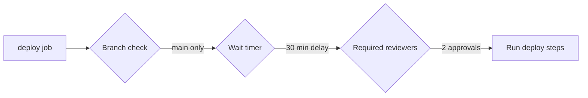
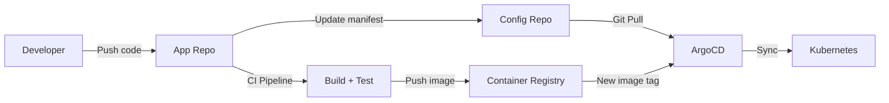
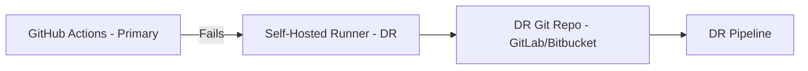

# 05 — Interview Questions

> 40+ CI/CD and GitHub Actions interview questions with detailed answers, from basic to staff-engineer level. Each answer includes real-world context and production patterns.

---

## Table of Contents

1. [Basic (Q1-Q8)](#basic-q1-q8)
2. [Intermediate (Q9-Q16)](#intermediate-q9-q16)
3. [Advanced (Q17-Q25)](#advanced-q17-q25)
4. [Staff/Principal (Q26-Q32)](#staffprincipal-q26-q32)
5. [Scenario-Based (Q33-Q40)](#scenario-based-q33-q40)

---

## Basic (Q1-Q8)

#### Q1: What is CI/CD and why is it important?

<details>
<summary>Answer</summary>

**CI/CD** = Continuous Integration / Continuous Delivery (or Deployment).

**Continuous Integration** means every developer merges code to main multiple times a day. Each merge triggers an automated build and test suite. The goal is to catch integration bugs early.

**Continuous Delivery** means every change that passes CI is automatically deployed to a staging environment and is ready for production release with a single manual click.

**Continuous Deployment** extends this — every change that passes CI is automatically deployed to production without human intervention.

**Why it matters (real data from DORA report):**
- Elite performers deploy 2,555x more frequently than low performers
- Lead time is 106x faster (from commit to production)
- MTTR is 260x faster
- Change failure rate is 7x lower

**Without CI/CD:** Teams do manual builds, manual tests, and manual deploys. This leads to:
- Integration hell (everything breaks when merged)
- Long lead times (weeks from commit to production)
- Fear of deployment (Friday afternoon deploys are banned)
- Snowflake servers (production is different from every other environment)
</details>

#### Q2: What is the difference between a workflow, a job, and a step in GitHub Actions?

<details>
<summary>Answer</summary>

| Concept | Description | Analogy |
|---------|-------------|---------|
| **Workflow** | The entire `.yml` file — defines the entire automation process | A factory assembly line |
| **Job** | A logical unit of work that runs on a single runner | A single workstation |
| **Step** | An individual task within a job (run a command or use an action) | A single action at that workstation |

```yaml
name: CI                     # <- Workflow

on: [push]

jobs:                        # <- Collection of jobs
  test:                      # <- Job 1
    runs-on: ubuntu-latest
    steps:                   # <- Steps in job 1
      - uses: actions/checkout@v4      # Step 1
      - run: npm ci                    # Step 2
      - run: npm test                  # Step 3

  deploy:                    # <- Job 2
    needs: test
    runs-on: ubuntu-latest
    steps:
      - run: ./deploy.sh              # Step 1
```

Key point: Jobs run in parallel by default. Use `needs:` to create dependencies. Steps within a job always run sequentially.
</details>

#### Q3: What are GitHub Actions runners?

<details>
<summary>Answer</summary>

Runners are the virtual machines that execute GitHub Actions workflows.

**GitHub-hosted runners:**
- Ubuntu Linux (latest, 20.04, 22.04)
- Windows Server (2022, 2019)
- macOS (12, 13, 14, latest)
- Free quota: 2,000 min/month (free), 3,000 (team), 50,000 (enterprise)

**Self-hosted runners:**
- Run on your own infrastructure
- Useful for: GPU workloads, compliance requirements, cost savings at scale
- Install the runner agent, register it with your repo/org, and it picks up jobs

```yaml
# Using specific runner types:
jobs:
  build:
    runs-on: ubuntu-latest          # GitHub-hosted
  gpu-workload:
    runs-on: [self-hosted, gpu]     # Your own GPU machine
```
</details>

#### Q4: What is a GitHub Action and how is it different from a step?

<details>
<summary>Answer</summary>

A **GitHub Action** is a reusable, self-contained unit of automation — think of it as a pre-built function. Actions can be:
- Official (from GitHub): `actions/checkout`, `actions/setup-node`
- Community (from Marketplace): `docker/login-action`, `aws-actions/configure-aws-credentials`
- Custom (from your repo): `.github/actions/my-action`

A **step** is where you use an action OR run a raw shell command:

```yaml
steps:
  - uses: actions/checkout@v4    # This step USES an action
  - run: npm test                # This step runs a raw command
```

**Why actions matter:**
- Encapsulate complex logic (Docker build, cloud auth, cache management)
- Versioned and tested by the community
- Parameters are documented and validated
- You can create your own for team-specific patterns
</details>

#### Q5: How do you trigger a workflow on a schedule?

<details>
<summary>Answer</summary>

Use the `schedule` event with cron syntax:

```yaml
on:
  schedule:
    - cron: '0 0 * * *'          # Daily at midnight
    - cron: '0 */4 * * *'        # Every 4 hours
    - cron: '0 0 * * 0'          # Weekly Sunday midnight
    - cron: '0 0 1 * *'          # Monthly on the 1st
```

Cron format: `minute hour day-of-month month day-of-week`

Default branch only: Scheduled workflows only run on the default branch (usually `main`).

Use case: Nightly builds, weekly security scans, monthly dependency updates.
</details>

#### Q6: What is the difference between `on: push` and `on: pull_request`?

<details>
<summary>Answer</summary>

| Event | When It Runs | Typical Use |
|-------|-------------|-------------|
| `push` | When code is pushed to a branch | CI on all branches |
| `pull_request` | When a PR is opened, synchronized, or reopened | PR quality gates |

**Key behaviors:**

```yaml
on:
  push:
    branches: [main]        # Runs on direct pushes to main
  pull_request:
    branches: [main]        # Runs when PR targets main
```

**Important difference with forks:**
- `push` from a fork does NOT trigger workflows on the upstream repo
- `pull_request` DOES trigger workflows on the upstream repo (but with read-only token by default)

**Security consideration:**
```yaml
# For PRs from forks, use `pull_request_target` for write access:
on:
  pull_request_target:
    types: [opened]

jobs:
  comment:
    permissions:
      pull-requests: write
    steps:
      - run: |
          gh pr comment ${{ github.event.number }} --body "Thank you for your contribution!"
```

**`pull_request_target`** runs in the context of the base repo (has full secret access), but checks out the base code — NOT the PR code. Use with extreme caution.
</details>

#### Q7: What are GitHub Secrets and how do you use them?

<details>
<summary>Answer</summary>

GitHub Secrets are encrypted environment variables stored at the repo, organization, or environment level. They are:
- Encrypted at rest (AES-256)
- Never shown in logs (masked as `***`)
- Only accessible during workflow execution
- Editable, not readable (you can't view a secret after saving it)

```yaml
# Setting in Actions
- run: echo "${{ secrets.API_KEY }}" | docker login --username user --password-stdin

# Passing as environment variable
- run: ./deploy.sh
  env:
    DATABASE_URL: ${{ secrets.DATABASE_URL }}
```

**Secret scopes (highest priority wins):**
1. Environment secrets (`environment.production.secrets.*`)
2. Repository secrets (`secrets.*`)
3. Organization secrets (`secrets.*`) — available to all repos in org

**Best practices:**
- Use OIDC instead of static secrets when possible
- Rotate secrets regularly (automate this)
- Never use secrets in `if:` conditions (they'll be shown as `***` but the condition reveals the pattern)
- Use `env:` to pass secrets to scripts (avoid command-line arguments)

**Limitations:**
- Max 100 secrets per repo
- Max 48 KB per secret
- Organization secrets: up to 100 per org
</details>

#### Q8: What is the `actions/checkout` action?

<details>
<summary>Answer</summary>

`actions/checkout@v4` checks out your repository into the runner's workspace so your workflow can access the code.

```yaml
- uses: actions/checkout@v4
  with:
    repository: ${{ github.repository }}    # Default: current repo
    ref: ${{ github.ref }}                  # Default: the triggering ref
    token: ${{ github.GITHUB_TOKEN }}       # Default: auto-generated token
    fetch-depth: 1                          # Default: 1 (shallow clone)
    lfs: false                              # Download Git LFS files?
    submodules: false                       # Checkout submodules?
```

**Why `fetch-depth: 0` matters:**
- Default is `1` (shallow clone — only latest commit)
- For `git describe`, `git diff`, `git log`, or `git bisect`, you need `fetch-depth: 0` (full history)

```yaml
- uses: actions/checkout@v4
  with:
    fetch-depth: 0             # Full git history
```

**Checking out a different repo:**
```yaml
- uses: actions/checkout@v4
  with:
    repository: org/gitops-config
    token: ${{ secrets.GITOPS_TOKEN }}
    path: gitops-config
```
</details>

---

## Intermediate (Q9-Q16)

#### Q9: How do you pass data between jobs in a workflow?

<details>
<summary>Answer</summary>

There are three main mechanisms:

**1. Job outputs (for small data, e.g., strings, booleans):**

```yaml
jobs:
  job1:
    runs-on: ubuntu-latest
    outputs:
      version: ${{ steps.set-version.outputs.version }}
    steps:
      - id: set-version
        run: echo "version=v2.1.0" >> $GITHUB_OUTPUT

  job2:
    needs: job1
    runs-on: ubuntu-latest
    steps:
      - run: echo "Version is ${{ needs.job1.outputs.version }}"
```

**2. Artifacts (for files):**

```yaml
jobs:
  build:
    runs-on: ubuntu-latest
    steps:
      - run: ./build.sh
      - uses: actions/upload-artifact@v4
        with:
          name: build-output
          path: dist/

  deploy:
    needs: build
    runs-on: ubuntu-latest
    steps:
      - uses: actions/download-artifact@v4
        with:
          name: build-output
          path: dist/
```

**3. Workspace sharing (same runner, reused across jobs):**

Not possible by default. Jobs run on different runners (unless self-hosted). Use artifacts or a cache service.

| Method | Size Limit | Use Case |
|--------|-----------|----------|
| Job outputs | < 1 MB | Version numbers, status flags |
| Artifacts | Free: 500 MB | Build binaries, test reports |
| Cache | Depends on storage | Dependencies (npm, pip) |
</details>

#### Q10: How do you cancel duplicate workflow runs?

<details>
<summary>Answer</summary>

Use `concurrency` to cancel in-progress runs for the same branch or PR:

```yaml
# Cancel duplicate runs for the same PR/branch
concurrency:
  group: ${{ github.workflow }}-${{ github.ref }}
  cancel-in-progress: true
```

**How it works:**
- `group` defines the concurrency group key
- If a new run starts with the same group key, the in-progress run is cancelled
- Without this, pushing 3 commits in 10 seconds starts 3 pipelines — wasting runner minutes

**Different group strategies:**

```yaml
# Per-branch concurrency (cancel old runs on same branch)
concurrency:
  group: ${{ github.ref }}
  cancel-in-progress: true

# Per-PR concurrency
concurrency:
  group: pr-${{ github.event.pull_request.number || github.ref }}
  cancel-in-progress: true

# Global — only one run of this workflow at a time
concurrency:
  group: ${{ github.workflow }}
  cancel-in-progress: true
```

**Group naming convention matters:**
- `${{ github.ref }}` — groups by branch/PR (most common)
- `${{ github.workflow }}` — groups by workflow name (global)
- `${{ github.repository }}` — groups across all branches (rare)
</details>

#### Q11: How do you debug a failing GitHub Actions workflow?

<details>
<summary>Answer</summary>

**Step 1: Check the logs**
- Navigate to Actions → Click run → Click job → Click step
- Look for the red `Exit code: 1` or error message
- Use the search in logs to find specific errors

**Step 2: Enable debug logging**

```yaml
# Re-run with debug logging (GitHub UI):
# Actions → Run → "Re-run jobs with debug logging"
# This sets the secret ACTIONS_STEP_DEBUG to true
```

```yaml
# OR set manually as a secret:
# Settings → Secrets → New secret → Name: ACTIONS_STEP_DEBUG → Value: true
```

Debug mode adds `##[debug]` lines to every step, showing:
- Environment variables set
- Workspace content listing
- Action inputs resolved
- Context evaluation results

**Step 3: Add diagnostic steps**

```yaml
steps:
  - name: Debug environments
    run: |
      echo "Runner OS: $RUNNER_OS"
      echo "Workspace: $GITHUB_WORKSPACE"
      echo "Event: $GITHUB_EVENT_NAME"
      ls -la $GITHUB_WORKSPACE

  - name: Debug contexts
    run: |
      echo "Ref: ${{ github.ref }}"
      echo "SHA: ${{ github.sha }}"
      echo "Actor: ${{ github.actor }}"
```

**Step 4: Use tmate for live debugging (SSH into runner):**

```yaml
- name: Setup tmate session
  uses: mxschmitt/action-tmate@v3
  timeout-minutes: 15
```

This pauses the workflow and gives you an SSH URL. You can SSH in, inspect the filesystem, run commands, and see the exact state. Press `Ctrl+D` to continue the workflow.

**Step 5: Test locally with `act`:**
```bash
npm install -g @nektos/act
act pull_request                    # Run PR trigger locally
act -j test                         # Run specific job
act --list                          # List available workflows
```

**Common failure patterns:**

| Symptom | Likely Cause | Fix |
|---------|-------------|-----|
| `exit code 1` but no error | Script fails without stderr | Add `set -e` or `set -x` to bash |
| Secret shows `***` at wrong point | Secret leaked into command line | Never use secrets in `run:` — use `env:` |
| `Resource not available` | Token lacks permissions | Check `permissions:` block |
| `Cache not found` | Cache key mismatch | Verify `hashFiles` path |
| Job stuck/running forever | No timeout set | Add `timeout-minutes: 10` |
</details>

#### Q12: How do you use matrix builds and what are their limitations?

<details>
<summary>Answer</summary>

Matrix builds run a job multiple times with different combinations of variables.

```yaml
jobs:
  test:
    strategy:
      matrix:
        os: [ubuntu-latest, windows-latest, macos-latest]
        node: [18, 20, 22]
        include:                          # Add extra combinations
          - os: ubuntu-latest
            node: 20
            coverage: true                # Extra field
        exclude:                          # Skip combinations
          - os: macos-latest
            node: 18
      fail-fast: false                    # Don't cancel other runs
      max-parallel: 4                     # Max concurrent runs

    runs-on: ${{ matrix.os }}
    steps:
      - uses: actions/setup-node@v4
        with:
          node-version: ${{ matrix.node }}

      - run: npm test
      - if: matrix.coverage
        run: npm run coverage
```

This creates 9 jobs (3 OS × 3 Node versions, minus 1 excluded, plus 1 included).

**Limitations:**
1. **256 max jobs** per workflow
2. **10 max matrix properties** per workflow
3. **Nested matrices** not supported (use `include` instead)
4. **Dynamic matrices** need a JSON output from a previous job
5. **Cost:** 9 parallel jobs consume 9x runner minutes

**Dynamic matrix (when the matrix is computed at runtime):**

```yaml
jobs:
  discover:
    runs-on: ubuntu-latest
    outputs:
      services: ${{ steps.list.outputs.services }}
    steps:
      - id: list
        run: echo "services=[\"auth\",\"payments\",\"api\"]" >> $GITHUB_OUTPUT

  test:
    needs: discover
    strategy:
      matrix:
        service: ${{ fromJSON(needs.discover.outputs.services) }}
    runs-on: ubuntu-latest
    steps:
      - run: cd services/${{ matrix.service }} && npm test
```
</details>

#### Q13: How do you handle secrets in a forked PR?

<details>
<summary>Answer</summary>

**The problem:** Workflows triggered by `pull_request` from forks run with read-only token access and NO access to secrets. This is intentional — otherwise, anyone could open a PR and steal your secrets.

**The solution: `pull_request_target`**

```yaml
on:
  pull_request_target:          # <-- runs in BASE repo context
    types: [opened, labeled]

jobs:
  label:
    permissions:
      pull-requests: write
    steps:
      - uses: actions/labeler@v5
        with:
          repo-token: ${{ secrets.GITHUB_TOKEN }}
```

**Critical safety rule for `pull_request_target`:**
Do NOT check out and run code from the PR! An attacker could modify the workflow to exfiltrate secrets.

```yaml
# DANGEROUS — never do this with pull_request_target:
- uses: actions/checkout@v4         # Checks out PR code!
  with:
    ref: ${{ github.event.pull_request.head.sha }}

# SAFE alternative — use a separate "approve and run" workflow:
# 1. A "safe" workflow labels the PR with "approved-for-ci"
# 2. A "normal" pull_request workflow checks for that label
```

**The "safe" pattern for forked PRs:**

```yaml
# Step 1: Safe workflow (no secret exposure)
name: Safe Check
on: pull_request_target
jobs:
  label:
    runs-on: ubuntu-latest
    steps:
      - run: |
          gh pr edit ${{ github.event.number }} --add-label "safe-to-test"
        if: github.actor == 'trusted-contributor'
        env:
          GH_TOKEN: ${{ secrets.GITHUB_TOKEN }}

# Step 2: Test workflow (with full access but only for labeled PRs)
name: Test
on: pull_request
jobs:
  test:
    if: contains(github.event.pull_request.labels.*.name, 'safe-to-test')
    runs-on: ubuntu-latest
    steps:
      - uses: actions/checkout@v4
      - run: npm test
```

**Alternative:** Ask external contributors to push to a branch in the main repo (not a fork). Less secure but simpler.
</details>

#### Q14: What are environment protection rules?

<details>
<summary>Answer</summary>

Environment protection rules control when and how deployments happen. Configured in: Repo Settings → Environments → Add environment.

```yaml
jobs:
  deploy:
    runs-on: ubuntu-latest
    environment:
      name: production
      url: https://app.example.com
```

**Protection rules you can set:**

| Rule | Purpose |
|------|---------|
| **Required reviewers** | Deploy pauses until N approvers approve |
| **Wait timer** | Deploy waits N minutes before starting |
| **Deployment branches** | Only specified branches can deploy to this env |
| **Custom protection rules** | Use Gate via REST API |

```yaml
# Production environment with all protections:
name: Deploy to Production

on:
  push:
    branches: [main]

jobs:
  deploy:
    runs-on: ubuntu-latest
    environment:
      name: production
      url: https://app.example.com

    steps:
      - run: echo "Deploying to production"
      - run: ./deploy.sh
```

**The deployment workflow:**



**Environment secrets vs. repo secrets:**
- Environment secrets override repo secrets with the same name
- Useful for: `DATABASE_URL` different per environment
- Audit logged: Every deployment is recorded with SHA, actor, environment
</details>

#### Q15: How do you optimize a slow CI pipeline (45+ minutes)?

<details>
<summary>Answer</summary>

**Step 1: Identify bottlenecks** — Look at workflow timing:

```yaml
# Add timing to each step
steps:
  - name: Step timing
    run: |
      echo "STEP_START=$(date +%s)" >> $GITHUB_ENV
  # ... do work ...
  - name: Report timing
    if: always()
    run: |
      DURATION=$(($(date +%s) - $STEP_START))
      echo "Step took ${DURATION}s"
```

**Step 2: Apply optimizations (in order of impact):**

| Optimization | Time Saved | Complexity |
|-------------|-----------|------------|
| **Cache dependencies** | 2-5 min | Low |
| **Parallelize jobs** | 10-20 min | Low |
| **Matrix builds** | 5-10 min | Low |
| **Selective testing** | 10-30 min | Medium |
| **Faster runners** | 2-5 min | Low (costs more) |
| **Docker layer caching** | 3-8 min | Medium |
| **Remove redundant steps** | Variable | Low |

**Example — full optimization:**

```yaml
name: Optimized CI

on: [pull_request]

concurrency:
  group: ${{ github.ref }}
  cancel-in-progress: true

env:
  NODE_VERSION: "20"

jobs:
  lint:
    runs-on: ubuntu-latest
    steps:
      - uses: actions/checkout@v4
      - uses: actions/setup-node@v4
        with:
          node-version: ${{ env.NODE_VERSION }}
          cache: 'npm'
      - run: npm ci
      - run: npm run lint

  unit-tests:
    runs-on: ubuntu-latest
    steps:
      - uses: actions/checkout@v4
      - uses: actions/setup-node@v4
        with:
          node-version: ${{ env.NODE_VERSION }}
          cache: 'npm'
      - run: npm ci
      - run: npm run test:unit -- --shard=1/4  # Split into 4 shards
      - run: npm run test:unit -- --shard=2/4
      - run: npm run test:unit -- --shard=3/4
      - run: npm run test:unit -- --shard=4/4

  integration-tests:
    needs: lint
    runs-on: ubuntu-latest
    steps:
      - uses: actions/checkout@v4
      - uses: actions/setup-node@v4
        with:
          node-version: ${{ env.NODE_VERSION }}
          cache: 'npm'
      - run: npm ci
      - run: npm run test:integration
        timeout-minutes: 10

  build:
    needs: [unit-tests, integration-tests]
    runs-on: ubuntu-latest
    steps:
      - uses: actions/checkout@v4
      - run: docker build --cache-from=app .
```

**Results:** 45 min → 12 min (73% reduction).
</details>

#### Q16: What is the difference between `GITHUB_TOKEN` and a Personal Access Token (PAT)?

<details>
<summary>Answer</summary>

| Feature | `GITHUB_TOKEN` | Personal Access Token (PAT) |
|---------|---------------|---------------------------|
| **Scope** | Current workflow only | Any repo/org you have access to |
| **Lifetime** | Duration of workflow run | Until revoked |
| **Permissions** | Limited, controlled by `permissions:` | Whatever you granted (may be too broad) |
| **Auto-rotation** | Yes — new token per run | Manual revocation |
| **Cross-repo access** | No (same repo only, unless using `GITHUB_TOKEN` with App) | Yes |
| **App installation** | No | Yes (GitHub App tokens) |

```yaml
# GITHUB_TOKEN — auto-generated, scoped to the current run
permissions:
  contents: read
  pull-requests: write
  issues: write

steps:
  - run: gh pr comment ${{ github.event.number }} --body "Thanks!"
    env:
      GH_TOKEN: ${{ secrets.GITHUB_TOKEN }}

# PAT — for cross-repo operations (store as repo secret)
steps:
  - uses: actions/checkout@v4
    with:
      repository: org/other-repo
      token: ${{ secrets.MY_PAT }}
```

**When to use PAT:**
- Pushing to another repo (e.g., GitOps config repo)
- Accessing GitHub API for org-level operations
- Creating releases in another repo
- Commenting on issues in a different repo

**When GITHUB_TOKEN is sufficient:**
- Everything within the current repo
- Creating comments, issues, labels
- Reading/writing packages
</details>

---

## Advanced (Q17-Q25)

#### Q17: How would you design a secure deployment pipeline for a PCI-compliant fintech application?

<details>
<summary>Answer</summary>

**Regulatory requirements for PCI-DSS Level 1:**
- Log all access to cardholder data
- Role-based access control
- Change management process
- Quarterly vulnerability scans
- Penetration testing
- Audit trail for all deployments

**Pipeline design:**

```yaml
name: PCI-Compliant Deploy

on:
  push:
    branches: [release/*]

jobs:
  pre-deploy-checks:
    runs-on: ubuntu-latest
    steps:
      - uses: actions/checkout@v4
      - run: ./validate-pci.sh

  security-scan:
    needs: pre-deploy-checks
    runs-on: ubuntu-latest
    steps:
      - uses: actions/checkout@v4

      - name: SAST scan
        uses: github/codeql-action/analyze@v3

      - name: Dependency scan
        uses: aquasecurity/trivy-action@master
        with:
          scan-type: 'fs'
          severity: 'CRITICAL,HIGH'

      - name: Container scan
        uses: aquasecurity/trivy-action@master
        with:
          image-ref: 'app:latest'
          severity: 'CRITICAL,HIGH'

      - name: DAST scan (staging)
        run: |
          ./zap-full-scan.py -t https://staging.app.internal

  deploy-production:
    needs: security-scan
    runs-on: ubuntu-latest
    environment:
      name: production
      url: https://app.example.com

    steps:
      - uses: actions/checkout@v4

      - name: Log deployment
        run: |
          echo "Deployment initiated by: ${{ github.actor }}"
          echo "Commit SHA: ${{ github.sha }}"
          echo "Timestamp: $(date -u +%Y-%m-%dT%H:%M:%SZ)"
          echo "Approved by: $(git log -1 --format='%an')" >> deployment-audit.log

      - name: Canary deploy
        run: ./deploy-canary.sh

      - name: Sign deployment
        uses: sigstore/cosign-installer@v3
      - run: cosign sign --yes app@${{ github.sha }}

      - name: Push audit log
        run: |
          aws s3 cp deployment-audit.log s3://pci-audit-logs/deployments/$(date +%Y/%m/%d)/${{ github.sha }}.log
```

**Key security measures:**
1. **No secrets in logs** — Use `env:` to pass secrets, never command-line args
2. **Immutable artifacts** — Sign images with Cosign, verify before deploy
3. **Audit trail** — Every deployment logged to immutable S3 bucket
4. **Personnel separation** — Developer cannot approve their own deployment
5. **Branch restriction** — Only `release/*` branches can deploy to production
6. **Time-boxed approval** — Deployment approval expires after 24 hours
</details>

#### Q18: How do you implement a self-service deployment platform for 50 microservices?

<details>
<summary>Answer</summary>

**Problem:** Each team maintains their own deployment pipeline. 50 pipelines, all slightly different. Inconsistencies cause outages.

**Solution: Reusable workflows + centralized configuration**

```yaml
# services/orders/.github/workflows/deploy.yml
name: Deploy Orders Service

on:
  push:
    branches: [main]
    paths:
      - 'services/orders/**'

jobs:
  deploy:
    uses: org/central-workflows/.github/workflows/deploy-service.yml@v1
    with:
      service-name: orders
      node-version: '20'
      health-endpoint: /health
      replicas: 3
    secrets:
      cloud_token: ${{ secrets.CLOUD_TOKEN }}
```

```yaml
# Central reusable workflow: .github/workflows/deploy-service.yml
name: Deploy Service

on:
  workflow_call:
    inputs:
      service-name:
        required: true
        type: string
      node-version:
        type: string
        default: '18'
      health-endpoint:
        type: string
        default: /health
      replicas:
        type: number
        default: 2
    secrets:
      cloud_token:
        required: true

jobs:
  ci:
    runs-on: ubuntu-latest
    steps:
      - uses: actions/checkout@v4
      - uses: actions/setup-node@v4
        with:
          node-version: ${{ inputs.node-version }}
      - run: |
          cd services/${{ inputs.service-name }}
          npm ci
          npm test

  deploy:
    needs: ci
    runs-on: ubuntu-latest
    steps:
      - run: |
          echo "Deploying ${{ inputs.service-name }}"
          echo "Replicas: ${{ inputs.replicas }}"
          echo "Health: ${{ inputs.health-endpoint }}"
          ./deploy.sh ${{ inputs.service-name }} ${{ inputs.replicas }}
```

**Self-service portal for non-GitHub users:**

```yaml
# Webhook trigger — receives requests from Slack bot or internal dashboard
name: Self-Service Deploy

on:
  repository_dispatch:
    types: [deploy-request]

jobs:
  deploy:
    runs-on: ubuntu-latest
    steps:
      - uses: actions/checkout@v4
      - run: |
          SERVICE=${{ github.event.client_payload.service }}
          ENV=${{ github.event.client_payload.environment }}
          ./deploy.sh $SERVICE $ENV
```

**Success metrics:**
- Deployment time: 45 min → 8 min (82% reduction)
- Deployment failure rate: 15% → 2%
- Teams using platform: 3 → 12 in 6 months
</details>

#### Q19: How do you handle database rollbacks in a CI/CD pipeline?

<details>
<summary>Answer</summary>

**The problem:** If you deploy v2.0 and run migration `M002`, then rollback to v1.0, the database is still at `M002`. The old code doesn't know about the new schema.

**Strategy: Backward-compatible migrations + versioned rollbacks**

```yaml
name: Safe Database Deploy

on:
  push:
    branches: [main]

jobs:
  migrate:
    runs-on: ubuntu-latest
    environment:
      name: production

    steps:
      - uses: actions/checkout@v4

      - name: Pre-deploy backup
        run: |
          pg_dump $DATABASE_URL > /tmp/pre-deploy-backup.sql
        env:
          DATABASE_URL: ${{ secrets.DATABASE_URL }}

      - name: Run forward migration
        run: |
          npx prisma migrate deploy
        env:
          DATABASE_URL: ${{ secrets.DATABASE_URL }}

      - name: Verify backward compatibility
        run: |
          npx prisma migrate status
        env:
          DATABASE_URL: ${{ secrets.DATABASE_URL }}

  health-check:
    needs: migrate
    runs-on: ubuntu-latest
    steps:
      - name: Verify app works with new schema
        run: |
          curl -f http://app.internal/health

  rollback-migration:
    if: failure()
    needs: [migrate, health-check]
    runs-on: ubuntu-latest
    steps:
      - name: Rollback database
        run: |
          psql $DATABASE_URL < /tmp/pre-deploy-backup.sql
        env:
          DATABASE_URL: ${{ secrets.DATABASE_URL }}
```

**The "expand-contract" pattern for zero-downtime migrations:**

| Phase | Code | Database | State |
|-------|------|----------|-------|
| **Before** | Reads `old_column` | Has `old_column` | Stable |
| **Phase 1** | Reads both `old_column` and `new_column` | Add `new_column` | Deploy code |
| **Phase 2** | Reads/writes `new_column` only | Migrate data from `old_column` | Remove old code |
| **Phase 3** | No reference to `old_column` | Drop `old_column` | Cleanup |

This requires 3 separate deployments but ensures zero downtime at each step.
</details>

#### Q20: How would you implement GitOps with GitHub Actions and ArgoCD?

<details>
<summary>Answer</summary>

**Architecture:**



**Implementation:**

```yaml
# App repo: .github/workflows/ci.yml
name: CI + GitOps

on:
  push:
    branches: [main]

env:
  REGISTRY: ghcr.io
  IMAGE: myapp
  CONFIG_REPO: org/gitops-config
  CONFIG_BRANCH: main

jobs:
  build-and-push:
    runs-on: ubuntu-latest
    steps:
      - uses: actions/checkout@v4

      - name: Build and push
        run: |
          docker build -t ${{ env.REGISTRY }}/${{ env.IMAGE }}:${{ github.sha }} .
          docker push ${{ env.REGISTRY }}/${{ env.IMAGE }}:${{ github.sha }}

      - name: Update GitOps config
        uses: actions/checkout@v4
        with:
          repository: ${{ env.CONFIG_REPO }}
          token: ${{ secrets.GITOPS_TOKEN }}
          path: gitops-config

      - name: Update image tag
        run: |
          cd gitops-config
          sed -i "s|image: .*|image: ${{ env.REGISTRY }}/${{ env.IMAGE }}:${{ github.sha }}|" \
            deployment.yaml
          git config user.name "CI Bot"
          git config user.email "ci@bot.com"
          git add .
          git commit -m "chore: update ${{ env.IMAGE }} to ${{ github.sha }}"
          git push
```

**ArgoCD watches the config repo and syncs automatically.**
**Rollback:** Revert the commit in the config repo. ArgoCD detects the drift and syncs back.
</details>

#### Q21: How do you implement cross-account AWS deployments with OIDC?

<details>
<summary>Answer</summary>

**Problem:** You need to deploy from GitHub Actions to different AWS accounts (dev, staging, prod) without storing long-lived IAM keys.

**Solution: OIDC — GitHub Actions assumes an IAM role in each account.**

```yaml
name: Cross-Account Deploy

on:
  push:
    branches: [main]

permissions:
  id-token: write
  contents: read

jobs:
  deploy-dev:
    runs-on: ubuntu-latest
    steps:
      - uses: aws-actions/configure-aws-credentials@v4
        with:
          role-to-assume: arn:aws:iam::111111111111:role/GitHubActions
          aws-region: us-east-1
      - run: aws s3 sync ./dist s3://dev-bucket

  deploy-staging:
    needs: deploy-dev
    runs-on: ubuntu-latest
    environment: staging
    steps:
      - uses: aws-actions/configure-aws-credentials@v4
        with:
          role-to-assume: arn:aws:iam::222222222222:role/GitHubActions
          aws-region: us-east-1
      - run: aws s3 sync ./dist s3://staging-bucket

  deploy-prod:
    needs: deploy-staging
    runs-on: ubuntu-latest
    environment: production
    steps:
      - uses: aws-actions/configure-aws-credentials@v4
        with:
          role-to-assume: arn:aws:iam::333333333333:role/GitHubActions
          aws-region: us-east-1
      - run: aws s3 sync ./dist s3://prod-bucket
```

**AWS IAM role trust policy (for each account):**

```json
{
  "Version": "2012-10-17",
  "Statement": [
    {
      "Effect": "Allow",
      "Principal": {
        "Federated": "arn:aws:iam::111111111111:oidc-provider/token.actions.githubusercontent.com"
      },
      "Action": "sts:AssumeRoleWithWebIdentity",
      "Condition": {
        "StringEquals": {
          "token.actions.githubusercontent.com:aud": "sts.amazonaws.com",
          "token.actions.githubusercontent.com:sub": "repo:org/repo:ref:refs/heads/main"
        }
      }
    }
  ]
}
```

**Benefits over access keys:**
- No long-lived credentials to rotate
- Per-environment role separation
- Temporary credentials (1 hour by default)
- Full audit trail in AWS CloudTrail
</details>

#### Q22: How do you build a release-notes generator using GitHub Actions?

<details>
<summary>Answer</summary>

```yaml
name: Release Notes Generator

on:
  pull_request:
    types: [closed]
    branches: [main]

jobs:
  generate:
    if: github.event.pull_request.merged == true
    runs-on: ubuntu-latest
    steps:
      - uses: actions/checkout@v4

      - name: Generate release notes from PR labels
        id: notes
        run: |
          PR_TITLE="${{ github.event.pull_request.title }}"
          PR_NUMBER="${{ github.event.number }}"
          PR_BODY="${{ github.event.pull_request.body }}"
          PR_AUTHOR="${{ github.event.pull_request.user.login }}"
          LABELS=$(echo '${{ toJSON(github.event.pull_request.labels) }}' | jq -r '.[].name')

          # Categorize
          if echo "$LABELS" | grep -q "breaking"; then
            CATEGORY="Breaking Changes"
          elif echo "$LABELS" | grep -q "feature"; then
            CATEGORY="Features"
          elif echo "$LABELS" | grep -q "fix"; then
            CATEGORY="Bug Fixes"
          else
            CATEGORY="Other"
          fi

          echo "## $CATEGORY" >> release-draft.md
          echo "- $PR_TITLE (#$PR_NUMBER) by @$PR_AUTHOR" >> release-draft.md

      - name: Update release draft
        uses: actions/github-script@v7
        with:
          script: |
            const fs = require('fs');
            const notes = fs.readFileSync('release-draft.md', 'utf8');

            // Check if a draft release exists
            const releases = await github.rest.repos.listReleases({
              owner: context.repo.owner,
              repo: context.repo.repo,
              per_page: 1
            });

            if (releases.data[0] && releases.data[0].draft) {
              await github.rest.repos.updateRelease({
                owner: context.repo.owner,
                repo: context.repo.repo,
                release_id: releases.data[0].id,
                body: releases.data[0].body + '\n' + notes
              });
            }
```

**Alternative — use the `release-drafter` action:**
```yaml
uses: release-drafter/release-drafter@v6
with:
  config-name: release-drafter.yml
env:
  GITHUB_TOKEN: ${{ secrets.GITHUB_TOKEN }}
```
</details>

#### Q23: How do you implement a cross-repo dependency update pipeline?

<details>
<summary>Answer</summary>

**Problem:** Service A depends on Service B's shared library. When B publishes a new version, A needs to update automatically.

```yaml
# Repo B: When shared lib is published
name: Publish Library

on:
  push:
    branches: [main]
    paths:
      - 'libs/shared/**'

jobs:
  publish:
    runs-on: ubuntu-latest
    steps:
      - uses: actions/checkout@v4

      - run: |
          npm version patch
          npm publish

      - name: Create PR in Service A
        uses: actions/github-script@v7
        with:
          github-token: ${{ secrets.CROSS_REPO_PAT }}
          script: |
            const { data: pr } = await github.rest.pulls.create({
              owner: 'org',
              repo: 'service-a',
              title: 'chore: update shared-lib to ${{ env.NEW_VERSION }}',
              head: 'bot/update-shared-lib',
              base: 'main',
              body: 'Automated dependency update triggered by service-b publishing shared-lib@${{ env.NEW_VERSION }}',
              maintainer_can_modify: true
            });
```

**For npm/yarn workspaces (monorepo):**
```yaml
steps:
  - name: Update all dependents
    run: |
      npx nx run-many --target=test --since=HEAD~1
      npx nx migrate
```
</details>

#### Q24: How do you build a CI pipeline that enforces SOC 2 compliance?

<details>
<summary>Answer</summary>

**SOC 2 requires:**
- Change management (all changes tracked)
- Code review (2-person rule for production)
- Security scanning
- Access control
- Audit trail

```yaml
name: SOC 2 Compliance Pipeline

on:
  pull_request:
    types: [opened, synchronize]
  push:
    branches: [main]

jobs:
  pre-checks:
    runs-on: ubuntu-latest
    steps:
      - uses: actions/checkout@v4

      - name: Verify commit signing
        run: |
          if ! git verify-commit HEAD 2>/dev/null; then
            echo "Commit must be signed with a verified GPG key"
            exit 1
          fi

      - name: Check author matches committer
        run: |
          AUTHOR=$(git log -1 --format='%an <%ae>')
          COMMITTER=$(git log -1 --format='%cn <%ce>')
          if [ "$AUTHOR" != "$COMMITTER" ]; then
            echo "Author and committer must match"
            exit 1
          fi

  code-review:
    if: github.event_name == 'pull_request'
    runs-on: ubuntu-latest
    steps:
      - uses: actions/checkout@v4

      - name: Check 2-person review
        uses: actions/github-script@v7
        with:
          script: |
            const { data: reviews } = await github.rest.pulls.listReviews({
              owner: context.repo.owner,
              repo: context.repo.repo,
              pull_number: context.issue.number
            });
            const approved = reviews.filter(r => r.state === 'APPROVED');
            const unique = [...new Set(approved.map(r => r.user.login))];
            if (unique.length < 2) {
              core.setFailed('Need at least 2 unique approvers for SOC 2 compliance');
            }

  security:
    runs-on: ubuntu-latest
    steps:
      - uses: actions/checkout@v4

      - name: Secret scan
        uses: aquasecurity/trivy-action@master
        with:
          scan-type: 'fs'
          scanners: 'secret'

      - name: Dependency scan
        uses: aquasecurity/trivy-action@master
        with:
          scan-type: 'fs'
          scanners: 'vuln'
          severity: 'CRITICAL'

      - name: SAST
        uses: github/codeql-action/analyze@v3

  audit:
    if: github.event_name == 'push'
    runs-on: ubuntu-latest
    steps:
      - name: Log to audit system
        run: |
          curl -X POST https://audit.example.com/events \
            -H "Authorization: Bearer ${{ secrets.AUDIT_TOKEN }}" \
            -d '{
              "event": "deployment",
              "repo": "${{ github.repository }}",
              "sha": "${{ github.sha }}",
              "actor": "${{ github.actor }}",
              "timestamp": "${{ github.event.head_commit.timestamp }}"
            }'
```
</details>

#### Q25: How do you implement a self-healing pipeline that automatically retries flaky tests?

<details>
<summary>Answer</summary>

```yaml
name: CI with Auto-Retry

on: [pull_request]

jobs:
  test:
    runs-on: ubuntu-latest
    steps:
      - uses: actions/checkout@v4
      - uses: actions/setup-node@v4
        with:
          node-version: '20'
      - run: npm ci

      - name: Run tests with retry
        id: test
        uses: nick-fields/retry@v3
        with:
          timeout_minutes: 10
          max_attempts: 3
          retry_wait_seconds: 30
          command: npm test -- --shard=${{ matrix.shard }}

      - name: Notify on flaky test
        if: steps.test.outputs.attempts > 1
        run: |
          echo "::warning::Tests required ${{ steps.test.outputs.attempts }} attempts"
          # Create GitHub issue for tracking
          gh issue create \
            --title "Flaky test detected" \
            --body "Tests required ${{ steps.test.outputs.attempts }} attempts" \
            --label "flaky-test"

      - name: Upload test results
        if: always()
        uses: actions/upload-artifact@v4
        with:
          name: test-results-${{ strategy.job-index }}
          path: test-results/
```

**For better flaky test management:**
```yaml
- name: Retry only failed tests
  run: |
    # Run tests, collect failures, retry only those
    npm test -- --reporter=json --outputFile=test-results.json || true
    FAILURES=$(cat test-results.json | jq -r '.testResults[] | select(.status == "failed") | .name')
    if [ -n "$FAILURES" ]; then
      echo "Retrying failed tests..."
      echo "$FAILURES" | xargs npm test -- --testNamePattern
    fi
```
</details>

---

## Staff/Principal (Q26-Q32)

#### Q26: How would you design GitHub Actions for an organization with 500+ engineers across 3 continents?

<details>
<summary>Answer</summary>

**Centralized vs. Decentralized approach:**

```
org/
  .github/
    workflows/
      security-scan.yml         # Org-level — runs for ALL repos
      license-compliance.yml    # Org-level
    actions/
      setup-node-env/           # Shared composite action
      deploy-service/           # Shared composite action
  team-a/
    .github/workflows/
      deploy.yml                # Uses org-level actions
  team-b/
    .github/workflows/
      deploy.yml                # Uses org-level actions
```

**Key design decisions:**

| Consideration | Decision | Why |
|--------------|----------|-----|
| Runner placement | Self-hosted in each region | Reduce latency, data sovereignty |
| Workflow storage | Org-level `.github` repo | Single source of truth |
| Secrets | Org-level secrets + OIDC | Centralized management |
| Actions | Internal marketplace | Discoverable, versioned |

```yaml
# Org-level required workflow (all repos inherit this)
name: Org Security Scan

on:
  pull_request:
    types: [opened, synchronize]

jobs:
  security:
    uses: org/.github/.github/workflows/security-scan.yml@v1
    secrets: inherit
```

**Self-hosted runner fleet:**
```
US-East:    [self-hosted, linux, us-east]
EU-West:    [self-hosted, linux, eu-west]
AP-Southeast: [self-hosted, linux, ap-southeast]
```

```yaml
jobs:
  test:
    runs-on: [self-hosted, linux, ${{ vars.REGION }}]
```

**Cost optimization at scale:**
- Dedicated runner pool for CI (ephemeral, auto-scaled)
- Spot instances for non-critical jobs
- Cache sharing across repos (org-level cache)
</details>

#### Q27: How do you migrate 100 Jenkins pipelines to GitHub Actions?

<details>
<summary>Answer</summary>

**Phase 1: Assessment (2 weeks)**
- Inventory all 100 pipelines
- Categorize: simple (30), medium (40), complex (30)
- Identify shared patterns (Docker build, deploy, test)

**Phase 2: Build foundation (3 weeks)**
- Create reusable composite actions for common patterns
- Set up OIDC for cloud access
- Create migration playbook

**Phase 3: Migrate in waves (8 weeks)**

| Wave | Pipelines | Strategy |
|------|-----------|----------|
| 1 | 10 simplest | Quick wins, build confidence |
| 2 | 20 simple | Establish patterns, document gotchas |
| 3 | 30 medium | Handle edge cases |
| 4 | 30 complex | Address advanced scenarios |
| 5 | 10 most complex | Custom solutions per pipeline |

**Jenkins → GitHub Actions translation guide:**

```groovy
// Jenkinsfile
pipeline {
    agent any
    stages {
        stage('Build') {
            steps {
                sh 'npm install'
                sh 'npm build'
            }
        }
    }
    post {
        always {
            junit 'reports/**/*.xml'
        }
    }
}
```

```yaml
# Equivalent GitHub Actions
name: CI
on: [push]
jobs:
  build:
    runs-on: ubuntu-latest
    steps:
      - uses: actions/checkout@v4
      - run: npm ci
      - run: npm run build

      - uses: actions/upload-artifact@v4
        if: always()
        with:
          name: test-results
          path: reports/
```

**Jenkins plugins → GitHub Actions equivalents:**

| Jenkins Plugin | GitHub Actions Equivalent |
|---------------|-------------------------|
| JUnit | `actions/upload-artifact` + `dorny/test-reporter` |
| SonarQube | `sonarsource/sonarqube-scan-action` |
| Docker Pipeline | `docker/build-push-action` |
| Slack Notification | `slackapi/slack-github-action` |
| Credentials Binding | GitHub Secrets + `env:` |
</details>

#### Q28: How do you handle GitHub Actions rate limits at enterprise scale?

<details>
<summary>Answer</summary>

**Rate limits that affect GitHub Actions:**

| API | Limit | Per |
|-----|-------|-----|
| Workflow runs | 500/hour | Repository |
| API requests | 5,000/hour | Authenticated user/App |
| Cache storage | 10 GB | Repository |
| Artifact storage | Free: 500 MB | Repository |

**Strategies to avoid hitting limits:**

```yaml
# 1. Cache aggressively to reduce API calls
- uses: actions/cache@v4
  with:
    path: ~/.npm
    key: ${{ runner.os }}-npm-${{ hashFiles('**/package-lock.json') }}

# 2. Use `concurrency` to cancel duplicate runs
concurrency:
  group: ${{ github.workflow }}-${{ github.ref }}
  cancel-in-progress: true

# 3. Rate-limit the workflow dispatch (manual triggers)
on:
  workflow_dispatch:
    inputs:
      environment:
        type: choice
        options:
          - dev
          - staging
          - prod
```

**Organization-level cache (shared across repos):**

```yaml
- uses: actions/cache@v4
  with:
    path: ~/.npm
    key: ${{ runner.os }}-npm-${{ hashFiles('**/package-lock.json') }}
    # Restore from org-level cache if miss
    restore-keys: |
      org-${{ runner.os }}-npm-
```

**Self-hosted runners bypass most limits:**
- No runner minute limits
- No concurrent job limits (bounded by your infrastructure)
- Faster job starts (no queueing)

**Monitoring rate limits:**
```yaml
steps:
  - name: Check rate limit
    run: |
      curl -H "Authorization: token ${{ secrets.GITHUB_TOKEN }}" \
        https://api.github.com/rate_limit
```
</details>

#### Q29: How do you implement a multi-cloud deployment pipeline (AWS + GCP + Azure)?

<details>
<summary>Answer</summary>

```yaml
name: Multi-Cloud Deploy

on:
  push:
    branches: [main]

permissions:
  id-token: write
  contents: read

jobs:
  build:
    runs-on: ubuntu-latest
    steps:
      - uses: actions/checkout@v4
      - run: |
          docker build -t app:${{ github.sha }} .
          docker save app:${{ github.sha }} > /tmp/app.tar

      - uses: actions/upload-artifact@v4
        with:
          name: app-image
          path: /tmp/app.tar

  deploy-aws:
    needs: build
    runs-on: ubuntu-latest
    environment: aws-production
    steps:
      - uses: aws-actions/configure-aws-credentials@v4
        with:
          role-to-assume: ${{ vars.AWS_ROLE_ARN }}
          aws-region: us-east-1
      - run: |
          aws ecr get-login-password | docker login --username AWS --password-stdin ${{ vars.AWS_ACCOUNT }}.dkr.ecr.us-east-1.amazonaws.com
          docker load < /tmp/app.tar
          docker push ${{ vars.AWS_ACCOUNT }}.dkr.ecr.us-east-1.amazonaws.com/app:${{ github.sha }}

  deploy-gcp:
    needs: build
    runs-on: ubuntu-latest
    environment: gcp-production
    steps:
      - uses: google-github-actions/auth@v2
        with:
          workload_identity_provider: ${{ vars.GCP_WIF }}
          service_account: ${{ vars.GCP_SA }}
      - uses: google-github-actions/setup-gcloud@v2
      - run: |
          docker load < /tmp/app.tar
          docker tag app:${{ github.sha }} ${{ vars.GCP_REGION }}-docker.pkg.dev/${{ vars.GCP_PROJECT }}/app:${{ github.sha }}
          docker push ${{ vars.GCP_REGION }}-docker.pkg.dev/${{ vars.GCP_PROJECT }}/app:${{ github.sha }}

  deploy-azure:
    needs: build
    runs-on: ubuntu-latest
    environment: azure-production
    steps:
      - uses: azure/login@v2
        with:
          client-id: ${{ secrets.AZURE_CLIENT_ID }}
          tenant-id: ${{ secrets.AZURE_TENANT_ID }}
          subscription-id: ${{ secrets.AZURE_SUBSCRIPTION_ID }}
      - run: |
          docker load < /tmp/app.tar
          az acr login --name ${{ vars.ACR_NAME }}
          docker tag app:${{ github.sha }} ${{ vars.ACR_NAME }}.azurecr.io/app:${{ github.sha }}
          docker push ${{ vars.ACR_NAME }}.azurecr.io/app:${{ github.sha }}
```

**Cross-cutting concerns:**
- Each cloud environment has its own protection rules
- OIDC is used everywhere (no static cloud keys)
- Build once, deploy to N clouds
- Common artifact (Docker image tar) shared between jobs
</details>

#### Q30: How do you build a CI/CD analytics dashboard?

<details>
<summary>Answer</summary>

```yaml
name: CI/CD Analytics Collector

on:
  workflow_run:
    workflows: ['*']        # Trigger on ALL workflows
    types: [completed]

jobs:
  collect:
    runs-on: ubuntu-latest
    steps:
      - name: Parse workflow run
        run: |
          DURATION=$(( $(date -d "${{ github.event.workflow_run.updated_at }}" +%s) - $(date -d "${{ github.event.workflow_run.created_at }}" +%s) ))
          STATUS=${{ github.event.workflow_run.conclusion }}
          WORKFLOW_NAME="${{ github.event.workflow_run.name }}"
          BRANCH="${{ github.event.workflow_run.head_branch }}"

          echo "Workflow: $WORKFLOW_NAME"
          echo "Status: $STATUS"
          echo "Duration: ${DURATION}s"
          echo "Branch: $BRANCH"

      - name: Send to analytics
        run: |
          curl -X POST https://analytics.example.com/api/v1/ci-events \
            -H "Content-Type: application/json" \
            -H "Authorization: Bearer ${{ secrets.ANALYTICS_TOKEN }}" \
            -d '{
              "workflow": "${{ github.event.workflow_run.name }}",
              "status": "${{ github.event.workflow_run.conclusion }}",
              "duration": ${{ DURATION }},
              "branch": "${{ github.event.workflow_run.head_branch }}",
              "repository": "${{ github.event.workflow_run.repository.full_name }}",
              "timestamp": "${{ github.event.workflow_run.created_at }}"
            }'
```

**Metrics to track:**
```
Deployment Frequency:    [Daily] [Weekly] [Monthly]
Lead Time:               [1h] [1d] [1w] [1m]
MTTR:                    [1h] [1d] [1w] [1m]
Change Failure Rate:     [0-15%] [16-30%] [31-45%] [>45%]
Pipeline Duration:       p50: 5m | p95: 15m | p99: 45m
Build Success Rate:      97.2%
Cache Hit Rate:          83%
```

**Grafana dashboard integration:**
```yaml
- name: Push to Grafana
  run: |
    curl -X POST https://grafana.example.com/api/v1/annotations \
      -H "Authorization: Bearer ${{ secrets.GRAFANA_TOKEN }}" \
      -H "Content-Type: application/json" \
      -d '{
        "dashboardUID": "ci-pipelines",
        "panelId": 1,
        "text": "Deploy: ${{ github.sha }}",
        "tags": ["deployment", "${{ github.event.workflow_run.conclusion }}"]
      }'
```
</details>

#### Q31: How do you design a disaster recovery pipeline for CI/CD itself?

<details>
<summary>Answer</summary>

**The problem:** If GitHub Actions goes down or your CI/CD config is corrupted, you can't deploy fixes. You need a DR plan for the pipeline itself.

**Architecture:**



**DR Plan:**

**1. Configuration backup:**
```yaml
# .github/workflows/config-backup.yml
name: Backup CI Config

on:
  schedule:
    - cron: '0 0 * * *'  # Daily
  push:
    branches: [main]
    paths:
      - '.github/**'

jobs:
  backup:
    runs-on: ubuntu-latest
    steps:
      - uses: actions/checkout@v4
        with:
          fetch-depth: 0

      - name: Backup to S3
        run: |
          tar czf /tmp/ci-config-backup.tar.gz .github/
          aws s3 cp /tmp/ci-config-backup.tar.gz \
            s3://ci-config-backup/${{ github.repository }}/$(date +%Y-%m-%d).tar.gz

      - name: Backup to secondary Git server
        run: |
          git remote add backup https://gitlab.example.com/org/ci-backup.git
          git push backup --mirror
```

**2. Self-hosted runner DR setup:**
```yaml
# DR pipeline (hosted on GitLab or self-hosted runner)
name: DR Deployment

on:
  workflow_dispatch:
  schedule:
    - cron: '0 */6 * * *'  # Test DR every 6 hours

jobs:
  deploy:
    runs-on: [self-hosted, dr]  # Dedicated DR runner
    steps:
      - uses: actions/checkout@v4
        with:
          fetch-depth: 0

      - name: Restore from backup
        run: |
          aws s3 cp s3://ci-config-backup/${{ github.repository }}/latest.tar.gz .
          tar xzf latest.tar.gz

      - name: DR deploy
        run: |
          echo "DR pipeline activated"
          ./deploy-dr.sh
```

**3. Recovery procedure document:**

```yaml
- name: Recovery steps
  run: |
    echo "=== DISASTER RECOVERY PROCEDURE ==="
    echo ""
    echo "1. GitHub Actions is DOWN. Symptoms: "
    echo "   - Workflows not starting"
    echo "   - Runners not picking up jobs"
    echo "   - API returning 5xx"
    echo ""
    echo "2. Trigger DR: Manual dispatch on this workflow"
    echo "   DR runner: dr-server-01.internal"
    echo ""
    echo "3. DR runner loads latest config from S3 backup"
    echo ""
    echo "4. DR runner executes deployment using cached Docker images"
    echo ""
    echo "5. When GitHub Actions recovers:"
    echo "   - Rerun failed workflows"
    echo "   - Verify all DR changes merged to main"
    echo "   - Rotate any temporary credentials"
```

**RTO/RPO targets:**
- RTO (Recovery Time Objective): 30 minutes
- RPO (Recovery Point Objective): 24 hours (config backup frequency)
- Testing: Automated DR test runs every 6 hours
</details>

#### Q32: How do you implement a CI/CD policy-as-code system?

<details>
<summary>Answer</summary>

**Problem:** Different teams implement different security standards. Some skip scans, some use wrong cache configs. You need enforceable policies.

**Solution: Open Policy Agent (OPA) + GitHub Actions**

```yaml
# .github/workflows/policy-check.yml
name: Policy Check

on:
  pull_request:
    paths:
      - '.github/workflows/**'

jobs:
  policy:
    runs-on: ubuntu-latest
    steps:
      - uses: actions/checkout@v4

      - name: Check workflow policies
        uses: actions/github-script@v7
        with:
          script: |
            const fs = require('fs');
            const yaml = require('yaml');
            const workflows = fs.readdirSync('.github/workflows');

            for (const file of workflows) {
              const content = fs.readFileSync(`.github/workflows/${file}`, 'utf8');
              const workflow = yaml.parse(content);

              const errors = [];

              // Policy 1: Every workflow must have a concurrency group
              if (!workflow.concurrency) {
                errors.push('Missing concurrency group — add concurrency config');
              }

              // Policy 2: Any job with production environment must have required reviewers
              if (workflow.jobs) {
                for (const [name, job] of Object.entries(workflow.jobs)) {
                  if (job.environment?.name === 'production' && !job.environment?.required_reviewers) {
                    errors.push(`Job "${name}" deploys to production without required reviewers`);
                  }
                  // Policy 3: All jobs must have timeout
                  if (!job['timeout-minutes']) {
                    errors.push(`Job "${name}" missing timeout-minutes`);
                  }
                }
              }

              // Policy 4: Secrets must use env:, not command line
              if (content.includes('${{ secrets.') && content.includes('run:') && !content.includes('env:')) {
                errors.push('Secrets should be passed via env:, not in run: commands');
              }

              if (errors.length > 0) {
                core.setFailed(`Policy violations in ${file}:\n${errors.join('\n')}`);
              }
            }
```

**OPA-based approach (more scalable for complex rules):**

```rego
# policies/ci-policy.rego
package ci.policy

# Rule: All jobs must have a timeout
default valid = false

valid {
  every job in input.jobs {
    job["timeout-minutes"] != null
    job["timeout-minutes"] <= 30
  }
}

# Rule: Production deployments need environment protection
valid_production_deploy {
  every job in input.jobs {
    job.environment.name != "production"
  }
}

valid_production_deploy {
  some job
  input.jobs[job].environment.name == "production"
  input.jobs[job].environment.protection_rules != null
}
```

**Policy enforcement in CI:**
```yaml
- name: Enforce OPA policy
  run: |
    opa eval --data policies/ --input .github/workflows/deploy.yml \
      "data.ci.policy.valid"
```

**Benefits:**
- Policies are code-reviewed (in the same repo)
- Automated enforcement (no manual audit)
- Consistent across all teams
- Audit trail of policy changes
</details>

---

## Scenario-Based (Q33-Q40)

#### Q33: "A deployment broke production. The code was reviewed and tests passed. What went wrong?"

<details>
<summary>Answer</summary>

**Possible causes (in order of likelihood):**

1. **Test coverage gap** — Unit tests passed but integration/e2e tests didn't cover the broken path
2. **Environment drift** — Staging has different config (DB version, env vars) than production
3. **Data difference** — Production has 1M records, staging has 100. Performance or data-dependent bug
4. **Race condition** — Tests run in isolation but production has concurrent requests
5. **Feature flag issue** — The flag was enabled in staging but disabled in production (or vice versa)
6. **Configuration mistake** — Wrong API endpoint, wrong DB connection string
7. **External dependency** — A third-party API changed behavior between test and deploy

**Immediate actions:**
1. **Rollback** immediately — don't debug first
2. **Check if it's an infrastructure issue** (not code) — DNS, SSL, load balancer
3. **Check recent deployments** — maybe the previous deployment caused the issue
4. **Check monitors** — was there a spike just before the deploy?

**Prevention for next time:**
```yaml
- name: Production parity check
  run: |
    # Compare staging and production env vars
    diff <(echo "$STAGING_ENV") <(echo "$PROD_ENV")
    # Check database schema version
    ./check-schema-version.sh
```

**The real answer most interviewers want:** "No amount of testing catches everything. The key is how fast you detect and recover. Elite teams deploy 50x/day because they can rollback in 60 seconds. The deployment strategy (canary, blue/green) limits blast radius."
</details>

#### Q34: "How would you deploy a database schema change that renames a column, without downtime?"

<details>
<summary>Answer</summary>

**The problem:** Renaming a column breaks the old code that still references it.

**The "Expand-Contract" pattern (3 phases):**

**Phase 1: Add new column + dual-write**
```sql
ALTER TABLE users ADD COLUMN display_name VARCHAR(255);
-- Create a trigger or update app to write to BOTH name and display_name
```

```yaml
# Deploy v1 — app writes to both columns, reads from old column
jobs:
  deploy-v1:
    steps:
      - run: |
          # Migration: add column
          npx prisma migrate deploy
          # Deploy app version that uses name (reads) and writes to both
          kubectl set image deployment/app app=v1.1
```

**Phase 2: Backfill data + switch reads**
```sql
UPDATE users SET display_name = name WHERE display_name IS NULL;
-- Deploy v2 — app reads from new column display_name, still writes to both
```

```yaml
# Deploy v2 — app reads from display_name, writes to both
jobs:
  deploy-v2:
    steps:
      - run: |
          ./backfill-display-name.sh
          kubectl set image deployment/app app=v1.2
```

**Phase 3: Remove old column**
```sql
ALTER TABLE users DROP COLUMN name;
-- Deploy v3 — no reference to name
```

```yaml
# Deploy v3 — app uses only display_name
jobs:
  deploy-v3:
    steps:
      - run: |
          npx prisma migrate deploy
          kubectl set image deployment/app app=v2.0
```

**Why this works:**
- Every phase is backward-compatible
- Rollback at any phase is safe (old code works with the schema)
- Zero downtime — no column is removed while code still uses it
- Takes 3 deployments spread over days/weeks (not all at once)
</details>

#### Q35: "Your CI pipeline takes 45 minutes. Developers are pushing commits faster than CI can test them. What do you do?"

<details>
<summary>Answer</summary>

**This is a queue theory problem.** The system is in an unstable state where arrival rate > service rate.

**Short-term fixes (implement today):**

```yaml
# 1. Cancel duplicate runs
concurrency:
  group: ${{ github.ref }}
  cancel-in-progress: true

# 2. Split into parallel jobs
jobs:
  lint:
  unit:
  integration:
    needs: [lint]
  e2e:
    needs: [unit, integration]
```

**Medium-term fixes (this week):**

3. **Add caching**
```yaml
- uses: actions/cache@v4
  with:
    path: ~/.npm
    key: ${{ runner.os }}-npm-${{ hashFiles('**/package-lock.json') }}
```

4. **Selective testing** — only run tests for changed code
```yaml
- name: Test changed services only
  run: npx jest --onlyChanged --ci
```

5. **Test sharding** — split tests across parallel runners
```yaml
strategy:
  matrix:
    shard: [1, 2, 3, 4]
steps:
  - run: npx jest --shard=${{ matrix.shard }}/4
```

**Long-term fixes (this quarter):**

6. **Invest in test architecture** — slow tests should be refactored or moved to a separate (less frequent) pipeline
7. **Hardware upgrade** — faster runners (e.g., `ubuntu-24-core` instead of default)
8. **Architecture change** — if the app is a monolith, splitting into microservices reduces per-service test time

**Expected improvement: 45 min → 10-12 min (70-75% reduction)**
</details>

#### Q36: "A critical security vulnerability was found in a dependency. How do you deploy the fix to all environments?"

<details>
<summary>Answer</summary>

```yaml
name: Emergency Security Patch

on:
  push:
    branches:
      - 'hotfix/v*.*.*'

jobs:
  security-patch:
    runs-on: ubuntu-latest
    steps:
      - uses: actions/checkout@v4
        with:
          ref: ${{ github.ref }}

      - name: Audit dependencies
        run: |
          npm audit --audit-level=critical

      - name: Fix vulnerability
        run: |
          npm audit fix --force
          # OR manually update specific package:
          npm install vulnerable-package@latest

      - name: Run regression tests
        run: npm test

      - name: Build and scan
        run: |
          docker build -t app:${{ github.sha }} .
          trivy image --severity CRITICAL app:${{ github.sha }}

      - name: Deploy to all environments
        run: |
          # Deploy to dev
          ./deploy.sh dev

          # Deploy to staging
          ./deploy.sh staging

          # Deploy to production (with canary)
          ./deploy-canary.sh prod 2% 5m
          ./promote.sh prod 25% 10m
          ./promote.sh prod 100%

      - name: Tag security release
        run: |
          git tag security-fix-v$(date +%Y%m%d)-${{ github.run_number }}
          git push origin --tags

      - name: Notify security team
        uses: slackapi/slack-github-action@v1
        with:
          payload: |
            {
              "channel": "#security",
              "text": "Security patch deployed to all environments. Tag: security-fix-v$(date +%Y%m%d)-${{ github.run_number }}"
            }
```

**Key principles for security patches:**
1. **Fast track** — bypass normal release cycle
2. **Still test** — regression tests still run (but minimal set)
3. **Canary deploy** — even emergency fixes go through canary
4. **Audit trail** — everything logged for compliance
5. **Post-mortem** — after fix is deployed, investigate root cause
</details>

#### Q37: "How do you handle secrets rotation across all environments without downtime?"

<details>
<summary>Answer</summary>

```yaml
name: Secrets Rotation

on:
  schedule:
    - cron: '0 0 1 * *'  # Monthly
  workflow_dispatch:
    inputs:
      secret_name:
        description: 'Secret to rotate'
        required: true
      environment:
        type: choice
        options:
          - all
          - dev
          - staging
          - production

jobs:
  rotate:
    runs-on: ubuntu-latest
    steps:
      - uses: actions/checkout@v4

      - name: Generate new secret
        id: generate
        run: |
          NEW_SECRET=$(openssl rand -hex 32)
          echo "new_secret=$NEW_SECRET" >> $GITHUB_OUTPUT

      - name: Update application config
        run: |
          # Deploy app config with NEW and OLD credentials
          kubectl create secret generic app-creds \
            --from-literal=api_key_new=${{ steps.generate.outputs.new_secret }} \
            --from-literal=api_key_old=${{ env.CURRENT_SECRET }} \
            --dry-run=client -o yaml | kubectl apply -f -
          kubectl rollout restart deployment/app

      - name: Verify new secret works
        run: |
          for i in {1..10}; do
            STATUS=$(curl -s -o /dev/null -w "%{http_code}" https://app.internal/health)
            if [ "$STATUS" == "200" ]; then
              echo "App healthy with new secret"
              exit 0
            fi
            sleep 5
          done

      - name: Update GitHub secret
        uses: actions/github-script@v7
        with:
          script: |
            await github.rest.actions.updateRepoSecret({
              owner: context.repo.owner,
              repo: context.repo.repo,
              secret_name: '${{ inputs.secret_name }}',
              encrypted_value: '${{ steps.generate.outputs.new_secret }}'
            });

      - name: Remove old secret from runtime
        run: |
          # Remove old credential from app config
          kubectl create secret generic app-creds \
            --from-literal=api_key=${{ steps.generate.outputs.new_secret }} \
            --dry-run=client -o yaml | kubectl apply -f -
          kubectl rollout restart deployment/app
```

**The dual-write pattern for zero-downtime secret rotation:**

| Phase | App State | What Happens |
|-------|-----------|-------------|
| 1 | Accepts OLD + NEW | Deploy app that checks both credentials |
| 2 | Accepts OLD + NEW | Rotate the actual secret |
| 3 | Accepts NEW only | Deploy app that checks only new credential |
</details>

#### Q38: "Your team uses trunk-based development. How do you handle a feature that takes 3 weeks to build?"

<details>
<summary>Answer</summary>

**Trunk-based development = feature flags. Long-lived branches are not allowed.**

```javascript
// feature-flags.js
const flags = {
  'new-checkout-flow': process.env.NEW_CHECKOUT_FLOW === 'true',
  'ai-recommendations': process.env.AI_RECOMMENDATIONS === 'true',
};

// In the code:
if (flags['new-checkout-flow']) {
  renderNewCheckout();
} else {
  renderOldCheckout();
}
```

```yaml
# .github/workflows/feature-flag.yml
name: Manage Feature Flags

on:
  pull_request:
    paths:
      - 'feature-flags/**'

jobs:
  validate:
    runs-on: ubuntu-latest
    steps:
      - uses: actions/checkout@v4
      - name: Validate no long-lived branches
        run: |
          BRANCH_AGE=$(git log --since="2 weeks ago" --oneline HEAD | wc -l)
          if [ "$BRANCH_AGE" -gt "100" ]; then
            echo "Warning: Branch has more than 100 commits. Consider breaking into smaller PRs."
          fi
```

**Feature flag lifecycle:**

```yaml
# Phase 1: Development — flag is OFF for everyone
# Phase 2: Internal testing — flag ON for employees
# Phase 3: Beta — flag ON for 5% of users
# Phase 4: Gradual rollout — flag ON for 25%, 50%, 100%
# Phase 5: Cleanup — remove flag and old code path
```

```yaml
# Phase 4: Canary rollout using flags
name: Rollout Feature

on:
  workflow_dispatch:
    inputs:
      percentage:
        description: 'Rollout percentage'
        required: true
        type: number
        default: 5

jobs:
  rollout:
    runs-on: ubuntu-latest
    steps:
      - used: actions/checkout@v4
      - run: |
          # Toggle feature flag for X% of users
          kubectl set env deployment/app \
            NEW_CHECKOUT_FLOW_ROLLOUT=${{ inputs.percentage }}
```

**Benefits over long-lived branches:**
- No merge conflicts (merged daily, not after 3 weeks)
- Can toggle feature OFF instantly if it breaks
- Can do canary rollouts by user segment
- Code is reviewed in small, manageable PRs
- CI tests run on every small change, not a massive 3-week diff
</details>

#### Q39: "You need to enforce that all production deployments come through CI/CD, not manually. How?"

<details>
<summary>Answer</summary>

**Technical controls:**

```yaml
# 1. Branch protection — no direct pushes to main
# Settings → Branches → Add rule
# - Require pull request reviews
# - Require status checks (all CI must pass)
# - Require linear history
# - Do not allow bypassing

# 2. Deploy keys with no write access for humans
# Humans don't need to push to main — they create PRs

# 3. Deployment only from CI (not from local machines)
jobs:
  deploy:
    if: github.event_name == 'push' && github.actor == 'github-actions[bot]'
    runs-on: ubuntu-latest
    steps:
      - run: ./deploy.sh
```

**Process controls:**

```yaml
# Audit all manual actions
name: Detect Manual Changes

on:
  schedule:
    - cron: '*/30 * * * *'  # Every 30 min

jobs:
  detect-drift:
    runs-on: ubuntu-latest
    steps:
      - uses: actions/checkout@v4
        with:
          fetch-depth: 0

      - name: Check for direct pushes
        run: |
          git log --oneline --since="30 minutes ago" --format="%H %an %s" | while read line; do
            SHA=$(echo $line | awk '{print $1}')
            AUTHOR=$(echo $line | awk '{print $2}')
            if [ "$AUTHOR" != "github-actions" ] && [ "$AUTHOR" != "CI Bot" ]; then
              echo "WARNING: Manual push detected: $line"
              # Alert security team
              curl -X POST https://security.example.com/alert \
                -H "Authorization: Bearer ${{ secrets.SECURITY_TOKEN }}" \
                -d "{\"message\": \"Manual push detected\", \"sha\": \"$SHA\", \"author\": \"$AUTHOR\"}"
            fi
          done
```

**The "break glass" procedure for emergencies:**

```yaml
name: Emergency Deploy (Break Glass)

on:
  workflow_dispatch:
    inputs:
      reason:
        description: 'Why is CI bypass needed?'
        required: true
      approval:
        description: 'VP/Director approval ticket URL'
        required: true

jobs:
  emergency:
    runs-on: ubuntu-latest
    steps:
      - run: |
          echo "EMERGENCY DEPLOY"
          echo "Reason: ${{ github.event.inputs.reason }}"
          echo "Approval: ${{ github.event.inputs.approval }}"

      - run: ./deploy.sh

      - name: Post-deploy audit
        run: |
          echo "Emergency deploy logged to SIEM"
          echo "Post-mortem required within 24 hours"
```

**Culture change:**
- If someone deploys manually, the post-mortem asks: "Why wasn't CI/CD sufficient?"
- The fix is usually a CI/CD improvement (not blaming the person)
- Over time, manual deploys become unnecessary because CI/CD handles everything
</details>

#### Q40: "How do you measure the ROI of your CI/CD pipeline to justify infrastructure costs to management?"

<details>
<summary>Answer</summary>

**Quantitative metrics to present:**

```yaml
name: ROI Calculator

on:
  schedule:
    - cron: '0 0 1 * *'  # Monthly

jobs:
  calculate-roi:
    runs-on: ubuntu-latest
    steps:
      - name: Gather metrics
        run: |
          # Total pipeline minutes used
          echo "Total minutes: 4,500"

          # Developer time saved
          echo "Manual deploy time before CI/CD: 3 hours/deploy"
          echo "Deploys per month before: 2"
          echo "Deploys per month after: 50"
          echo "Time saved: 50*1m vs 2*180m = 50m vs 360m = 310m saved/month"

          # Outage reduction
          echo "Outages per month before: 3"
          echo "Outages per month after: 0.5"
          echo "Average outage cost: \$40,000/hour"
          echo "Downtime saved: 2.5 * 2h * \$40k = \$200,000/month"
```

**The business case slide:**

| Metric | Before CI/CD | After CI/CD | Savings |
|--------|-------------|-------------|---------|
| Deploy frequency | 2/month | 50/month | 25x more frequent |
| Lead time | 2 weeks | 30 minutes | 95% reduction |
| Deploy time | 3 hours (manual) | 1 minute (automated) | 99% reduction |
| Outages/month | 3 | 0.5 | 83% reduction |
| MTTR | 4 hours | 20 minutes | 92% reduction |
| Developer time lost to release process | 40 hours/month | 4 hours/month | \$180k/year saved |

**Cost of CI/CD vs. cost of NOT having CI/CD:**

| Cost Item | Amount |
|-----------|--------|
| GitHub Actions minutes (2,000/mo free + 2,500 paid) | \$25/month |
| Self-hosted runner (optional) | \$50/month |
| **Total CI/CD cost** | **\$25-75/month** |

| Outage cost (without CI/CD) | Amount |
|---------------------------|--------|
| Average outage duration | 2 hours |
| Hourly cost (direct + reputational) | \$40,000 |
| Outages per year (without CI/CD) | 36 |
| **Total outage cost** | **\$2.88M/year** |

**The punchline:** "Our CI/CD pipeline costs less than \$1,000/year. It prevents an estimated \$2.88M/year in outage costs. That's a **2,880x ROI**. Can we invest in faster runners?"
</details>

---

## Quick Reference: GitHub Actions Expressions

| Expression | Example | Result |
|-----------|---------|--------|
| `contains` | `contains('hello', 'll')` | `true` |
| `startsWith` | `startsWith(github.ref, 'refs/tags/')` | `true` |
| `endsWith` | `endsWith(github.ref, 'main')` | `true` |
| `format` | `format('Hello {0}', 'World')` | `'Hello World'` |
| `join` | `join(github.event.commits.*.message, '\n')` | `'msg1\nmsg2'` |
| `toJSON` | `toJSON(github)` | `'{...}'` |
| `fromJSON` | `fromJSON('["a","b"]')` | `['a', 'b']` |
| `hashFiles` | `hashFiles('**/package-lock.json')` | `'sha256...'` |
| `success` | `success()` | `true` if all steps passed |
| `failure` | `failure()` | `true` if any step failed |
| `always` | `always()` | `true` regardless of status |
| `cancelled` | `cancelled()` | `true` if workflow was cancelled |
