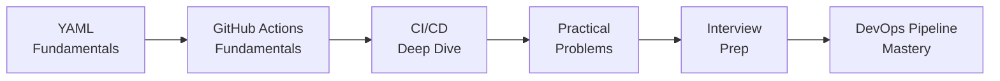

# CI/CD Pipelines — One Stop Learning

> A comprehensive guide covering YAML, GitHub Actions, and CI/CD pipelines from basics to advanced industry patterns.

---

## Contents

| # | Module | Description |
|---|--------|-------------|
| 1 | [YAML Basics](01-yaml-basics.md) | Syntax, data types, anchors, multi-line strings, advanced patterns |
| 2 | [GitHub Actions](02-github-actions.md) | Workflows, runners, expressions, contexts, matrix builds, reusable workflows |
| 3 | [CI/CD Deep Dive](03-ci-cd-deep-dive.md) | Pipeline stages, strategies, security, optimization, GitOps |
| 4 | [Practical Problems](04-practical-problems.md) | 15 real-world industry problem statements with complete pipeline solutions |
| 5 | [Interview Questions](05-interview-questions.md) | 30+ Q&A from basic to staff-level with real-world answers |

---

## Learning Path

---

## Prerequisites

- Basic understanding of Git and version control
- A GitHub account (free tier works)
- Node.js / Python / any language basics (for pipeline scripts)

## How to Use

1. Start with **YAML Basics** — every pipeline is defined in YAML
2. Move to **GitHub Actions** — understand workflows, runners, expressions
3. Read **CI/CD Deep Dive** — pipeline strategies and industry patterns
4. Solve **Practical Problems** — write and test your own pipelines
5. Review **Interview Questions** — prepare for DevOps interviews
